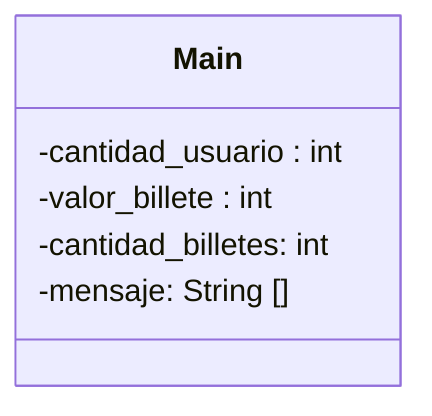

```mermaid
graph TD
    A(Preguntamos al usuario) -->B(Cantidad aceptada)
    B -->|Si| C(Seleccionamos billetes)
    B -->|No| D(Error)
    D --> A
    C --> E{Valor>500}
    E -->|Si| F
    E -->|No| G{Valor=0}
    G -->|Si| Z(Resultado)
    G -->|No| H{Valor>200}
    H -->|Si| I
    H -->|No| J{Valor=0}
    J -->|Si| Z(Resultado)
    J -->|No| K{Valor>100}
    K -->|Si| L
    K -->|No| M{Valor=0}
    M -->|Si| Z(Resultado)
    M -->|No| N{Valor>50}
    N -->|Si| Ñ
    N -->|No| O{Valor=0}
    O -->|Si| Z(Resultado)
    O -->|No| P{Valor>20}
    P -->|Si| Q
    P -->|No| R{Valor=0}
    R -->|Si| Z(Resultado)
    R -->|No| S{Valor>10}
    S -->|Si| T
    S -->|No| U{Valor=0}
    U -->|Si| Z(Resultado)
    U -->|No| V{Valor>5}
    V -->|Si| W
    V -->|No| X{Valor=0}
    X --> Z(Resultado)
    ```
    
